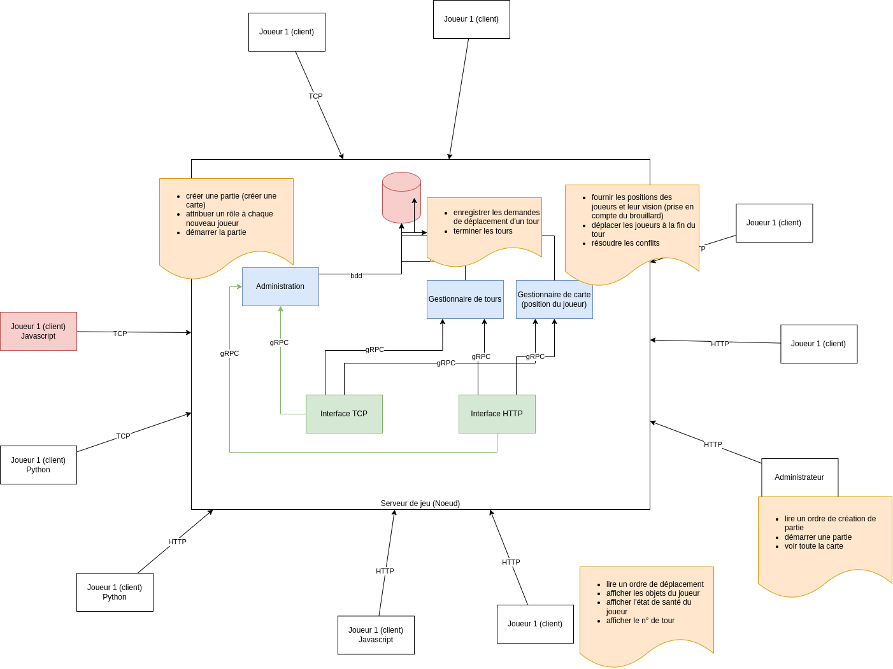
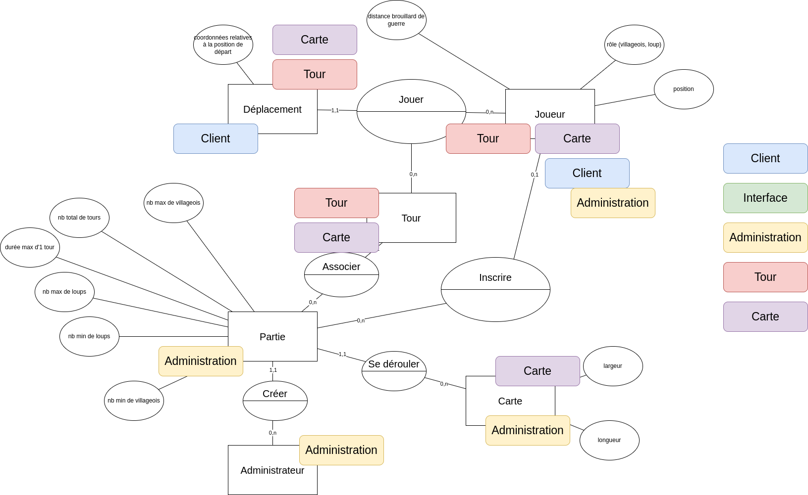

# Loup vs Villageois

## Règles du jeu

Un jeu multijoueur en tour par tour


2 types de joueur :
* loup
* villageois

Objectif du loup : attraper/éliminer tous les villageois
Objectif du villageois : échapper à tous les loups jusqu'à ce que la fin de partie soit déclarée

Comment un loup attrape un villageois ?
Un loup est sur la même case qu'un villageois

Environnement du jeu :
carte rectangulaire (largeur et longueur personnalisables), pas d'obstacle pour le moment

Déplacements des joueurs :
uniquement horizontal/vertical

Tour par tour :
 * nb total de tours pour 1 partie
 * chaque tour a une durée maximale d'attente en secondes

Pas de mécanisme d'authentification

Interface utilisateur : terminal en texte

## Déplacement et visibilité

Brouillard de guerre : visibilité de 1 case quelque soit le rôle du joueur
Aucune indication de position absolue

Carte vide :
```
x x x x
x x x x
x x x x
x x x x
```
Avec 1 Joueur W :

```
x x x x
x V x x
x x W x
x x x x
```
Vision du terrain accessible au joueur
```
V x x
x W x
x x x
```

W descend

```
x x x
x W x
- - -
```

Position de départ déterminée aléatoirement

Impossible d'avoir 2 villageois sur la même case à la fin d'un tour

Modérateur/Administrateur :
    * créer la partie :
      * nb de joueurs max par rôle
      * largeur de la carte
      * longueur de la carte
      * nb de tours
      * temps d'attente par tour

Attribution aléatoire des rôles en respectant les quotas définis

## Contraintes techniques

Architecture centralisée : tous les joeurs (clients) doivent communiquer avec le même noeud.

En python :

* [serveur TCP](https://docs.python.org/3/library/socketserver.html#socketserver-tcpserver-example)
* client TCP
* serveur HTTP
* client HTTP 
* client gRPC
* serveur gRPC

En javascript :
* client HTTP

En PHP
* serveur gRPC

## Affectation et Repos

* Lana : [tour]()
* Quentin : [client-admin-http]()
* William : [interface-tcp]()
* Anne : [client-tcp]()
* Steve : [interface-http]()
* Benjamin : [carte]()
* Nataël : [admin]()

## Schémas

### Architecture



### MCD



## Définition protocoles de communication

### Client TCP -> Interface TCP

Demander participation au jeu

Requête

```json
{
  "action": "participer",
  "login": "joueur1"
}
```

Réponse

```json
{
  "message": "ok" //ko
}
```


Envoyer un ordre de déplacement

Exemple message de la requête 

```json
{
  "action": "déplacement",
  "login": "joueur1",
  "destination": "haut" // bas, gauche, droite
}
```

Exemple message de la réponse

```json
{
  "message": "OK" // KO
}
```


Afficher les objets autour de moi


Exemple message de la requête 

```json
{
  "action": "afficher",
  "login": "joueur1"
}


Exemple message de la réponse

```json
{
  "grid": [
    ['.', '|', '_'],
    [' ', 'L', 'V'],
    ['J']
  ],
  "role": "L" // "V"
}
```
'.' : emplacement vide disponible
'|' : mur vertical
'_': mur horizontal
' ' : en dehors de la carte
'L' : emplacement occupé par un loup pendant le tour
'V' : emplacement occupé par un villageois pendant le tour
'J' : emplacement occupé par notre personnage

Afficher l'état de santé du joueur

Requête

```json
{
  "action": "santé",
  "login": "joueur1"
}
```

Réponse

```json
{
  "message": "En jeu" // Perdu 
}
```

Afficher le n° du tour en cours et le temps restant

Requête

```json
{
  "action": "tour",
  "login": "joueur1"
}
```

Réponse

```json
{
  "tour": 8,
  "temps_restant": 180 // secondes
}
```


### Admin HTTP -> Interface HTTP

Créer une partie

Requête

```json
{
  "action": "creer",
  "nb_de_tours_max": 10,
  "temps_max_du_tour": 9,
  "taille_carte": {
      "largeur": 10,
      "longueur": 12
  },
  "effectifs": {
    "loups": {
      "min": 1,
      "max": 2
    },
    "villageois": {
      "min": 1,
      "max": 12
    }
  }
}
```

Réponse

```json
{
  "id_partie": 1
}
```

Démarrer une partie


Requête

```json
{
  "id_partie": 1,
  "action": "démarrer"
}
```


Réponse

```json
{
  "message": "OK" // KO
}
```

Voir toute la carte


Requête

```json
{
  "action": "carte",
  "id_partie": 1
}
```

Réponse

```json
```json
{
  "grid": [
    ['.', '|', '_'],
    [' ', 'L', 'V'],
    ['J']
  ],
  "role": "L" // "V"
}
```

'.' : emplacement vide disponible
'|' : mur vertical
'_': mur horizontal
' ' : en dehors de la carte
'L' : emplacement occupé par un loup pendant le tour
'V' : emplacement occupé par un villageois pendant le tour

### Interface TCP -> Tour

```python
def enregistrer_deplacement(id_joueur, destination):
  pass
```

### Interface TCP -> Carte


```python
def 
```

### Interface HTTP -> Administration

## Commandes utiles

Générer les fichiers Python à partir du fichier proto

```bash
python -m grpc_tools.protoc -I. --python_out=. --pyi_out=. --grpc_python_out=. admin.proto
```