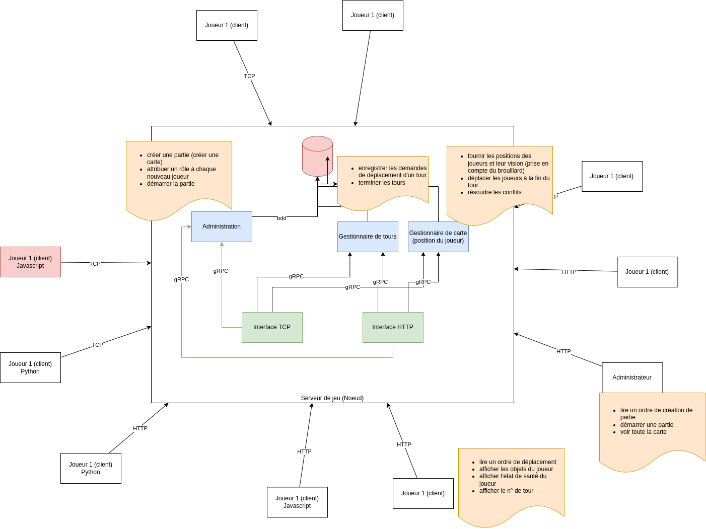
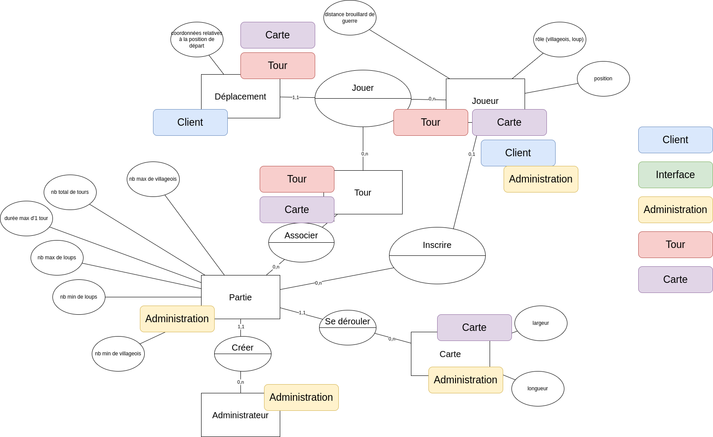

# Loup vs Villageois

## Règles du jeu

Un jeu multijoueur en tour par tour


2 types de joueur :
* loup
* villageois

Objectif du loup : attraper/éliminer tous les villageois
Objectif du villageois : échapper à tous les loups jusqu'à ce que la fin de partie soit déclarée

Comment un loup attrape un villageois ?
Un loup est sur la même case qu'un villageois

Environnement du jeu :
carte rectangulaire (largeur et longueur personnalisables), pas d'obstacle pour le moment

Déplacements des joueurs :
uniquement horizontal/vertical

Tour par tour :
 * nb total de tours pour 1 partie
 * chaque tour a une durée maximale d'attente en secondes

Pas de mécanisme d'authentification

Interface utilisateur : terminal en texte

## Déplacement et visibilité

Brouillard de guerre : visibilité de 1 case quelque soit le rôle du joueur
Aucune indication de position absolue

Carte vide :
```
x x x x
x x x x
x x x x
x x x x
```
Avec 1 Joueur W :

```
x x x x
x V x x
x x W x
x x x x
```
Vision du terrain accessible au joueur
```
V x x
x W x
x x x
```

W descend

```
x x x
x W x
- - -
```

Position de départ déterminée aléatoirement

Impossible d'avoir 2 villageois sur la même case à la fin d'un tour

Modérateur/Administrateur :
    * créer la partie :
      * nb de joueurs max par rôle
      * largeur de la carte
      * longueur de la carte
      * nb de tours
      * temps d'attente par tour

Attribution aléatoire des rôles en respectant les quotas définis

## Contraintes techniques

Architecture centralisée : tous les joeurs (clients) doivent communiquer avec le même noeud.

En python :

* [serveur TCP](https://docs.python.org/3/library/socketserver.html#socketserver-tcpserver-example)
* client TCP
* serveur HTTP
* client HTTP 
* client gRPC
* serveur gRPC

En javascript :
* client HTTP

En PHP
* serveur gRPC

## Affectation et Repos

* Lana : [tour]()
* Quentin : [client-admin-http]()
* William : [interface-tcp]()
* Anne : [client-tcp]()
* Steve : [interface-http]()
* Benjamin : [carte]()
* Nataël : [admin]()

## Schémas

### Architecture



### MCD

